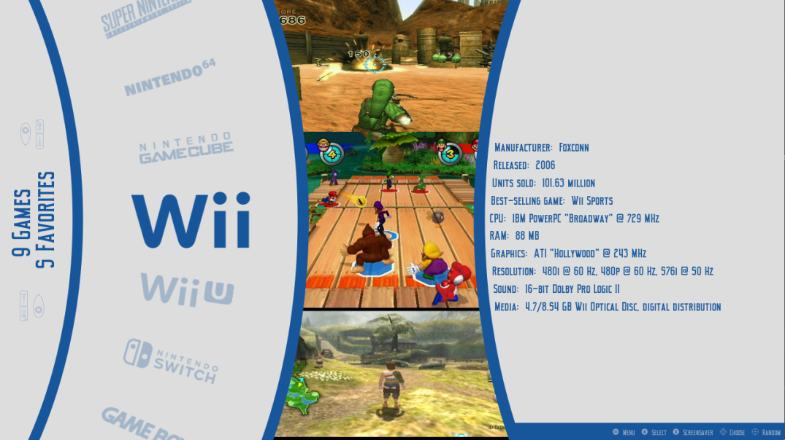
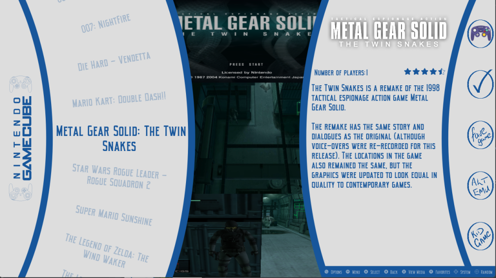

# CarAlt for EmulationStation Desktop Edition v2.0

A simple alternate carousel theme set for ES-DE.

The following options are included:

2 variants:

- With videos
- Without videos

12 color schemes:

- Black & White
- Gold
- Blue
- Gameboy
- Gameboy Shell
- Retro
- Stay Classy
- Commodore 64
- Chilled
- Purple Rain
- Rusty
- Sega

4 aspect ratios:

- 16:9
- 16:10
- 4:3
- 21:9

# Credits

The theme is has images from Dan Patricks Svg Logo set on launchbox forums
Support for creating theme from LeonSe on the official emulationstation discord
Inspiration and learning from Modernd-De and Slate-DE ESDE themes
